<div align="center">

# ThreatTrace

### Adaptive Cybersecurity Threat Detection & Analytics

**Upload security log. It works out what every column means, finds the threats, and explains itself.**

[](https://www.python.org/)
[](https://fastapi.tiangolo.com/)
[](https://react.dev/)
[](https://scikit-learn.org/)
[](#testing)
[](#why-no-llm)

</div>

---

## The problem

Every security tool names the same field differently. A SIEM pipeline normally needs a
hand-written mapping per data source, and it breaks the moment a vendor renames a column.

```
Dataset A   source_ip   destination_ip   failed_attempts        timestamp
Dataset B   src_addr    dst_host         login_fail             event_time
Dataset C   client_ip   server_ip        authentication_errors  created_at
```

Three schemas, zero shared column names, identical meaning. ThreatTrace resolves them
**semantically** - no config, no per-source mapping file.

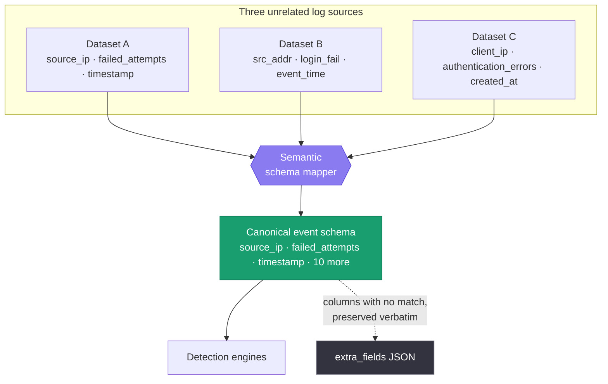

---

## Architecture

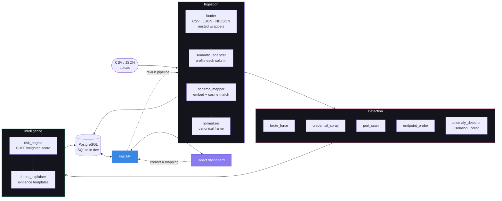

---

## How a column gets understood

Column names alone are unreliable, so each column is judged on **name + inferred type +
observed values**.

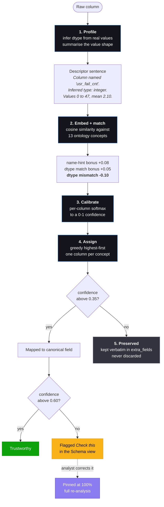

The **dtype-mismatch penalty** is what stops a string `cost_centre_code` from being read as
the integer `status_code` concept just because both contain the word "code".

### Two interchangeable embedding backends

| Backend | When | Trade-off |
|---|---|---|
| `sentence-transformers` (all-MiniLM-L6-v2) | installed via `requirements-ml.txt` | true paraphrase understanding, ~2 GB of torch |
| TF-IDF + cosine (scikit-learn only) | automatic fallback | no heavy dependency, weaker on synonyms |

Both are tested to map every sample column correctly, so the fallback is a real option and
not a degraded mode. Check which is live with `GET /api/health`.

---

## Detection engines

Four explainable rules plus unsupervised ML, all grouped per source IP over **densest
sliding windows** - a two-pointer scan finds the busiest window of a given size, so a burst
is never split across two fixed buckets.

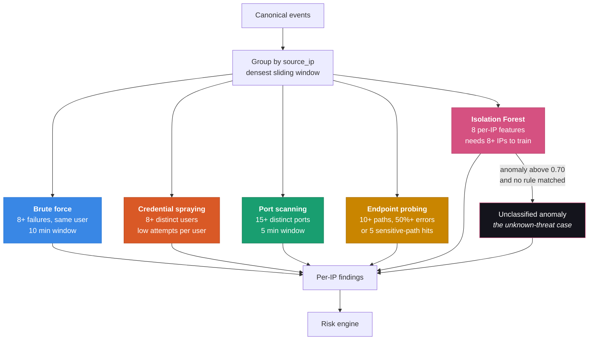

### The Isolation Forest does two jobs

1. It supplies the **behaviour-anomaly term of every risk score** (30% of the total).
2. It independently flags IPs that are statistically abnormal but matched **no rule at all**
   - the unknown-threat case a pure rule engine cannot reach.

Features: request rate, failure ratio, distinct ports / destinations / paths / usernames,
mean payload size, off-hours ratio.

### Detectors degrade honestly

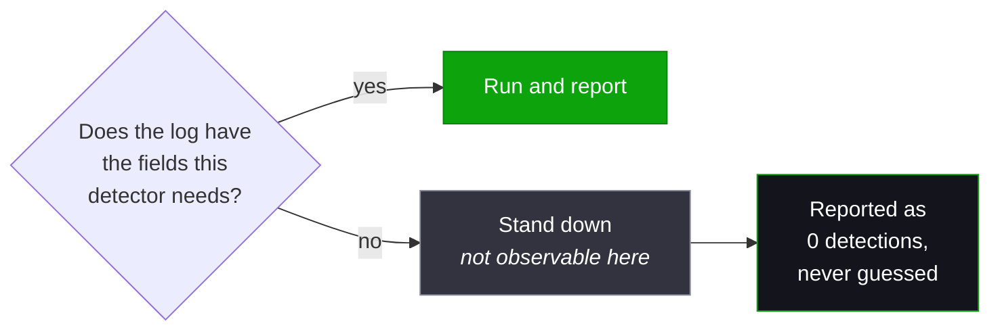

A log with no `username` column genuinely cannot reveal credential spraying, so that
detector stands down instead of inventing a finding. A 4-column dataset fires two of the
five, and says so.

---

## Risk scoring

Deterministic, weighted, reproducible - an analyst can always explain why a score is what
it is.

```
risk = 100 × ( 0.40 × threat_severity      ← strongest rule hit
             + 0.30 × behaviour_anomaly    ← Isolation Forest score
             + 0.15 × frequency            ← log-scaled event volume
             + 0.15 × confidence )         ← evidence volume × mapping confidence
```

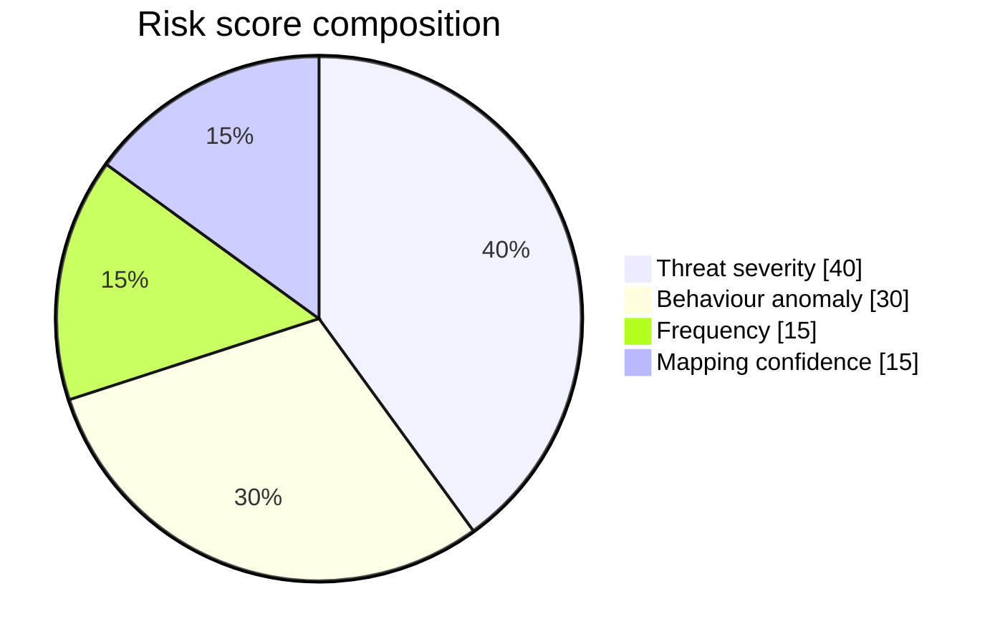

| Band | Score | Meaning |
|---|---|---|
| 🟢 **Low** | 0-39 | Background noise |
| 🟡 **Medium** | 40-59 | Worth a look |
| 🟠 **High** | 60-79 | Investigate |
| 🔴 **Critical** | 80-100 | Act now |

Note that **mapping confidence feeds the score**. A finding built on a shaky column
interpretation scores lower than the same finding built on a confident one.

---

## Explanations

Every finding is explained from a template filled with measured evidence.

> **🔴 Critical 95.6 - Possible credential spraying attack**
> `36.82.21.229` · China · 67 events
>
> **Evidence**
> - Contacted **45 distinct user accounts** with 67 failed attempts (1.49 attempts/user on average) within 10 minutes
> - Activity differs from the dataset's normal baseline, notably in: distinct usernames, off-hours ratio, distinct destinations
>
> **Recommended actions**
> 1. Block the source IP temporarily
> 2. Review all targeted accounts for signs of compromise
> 3. Enforce multi-factor authentication on affected accounts

### Why no LLM

No language-model call anywhere in the pipeline. That is a deliberate engineering choice,
not a missing feature:

| Property | Why it matters |
|---|---|
| **Reproducible** | the same log always yields the same verdict |
| **Auditable** | every number traces to a row in the data |
| **Offline** | runs air-gapped, which many SOCs require |
| **Free** | no per-token cost on a 100k-row log |

A finding that has to hold up in an incident review cannot come from a black box.

---

## The honest limitation, and the fix

Semantic matching has a real failure mode: **a wrong mapping produces a wrong finding
rather than no finding.** Confident matches (above ~0.7) are reliable; low-confidence ones
are frequently wrong, and similarity has no way to know that `LogonType` is not a failure
count.

So the fix is to make it **visible and correctable** rather than pretend it doesn't happen.

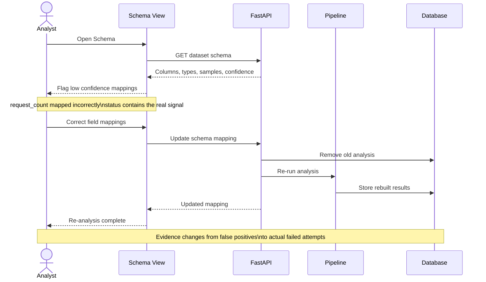

Two clicks, and every detection, score, and explanation is rebuilt from the corrected
mapping - never a mix of two.

### Dataset lifecycle

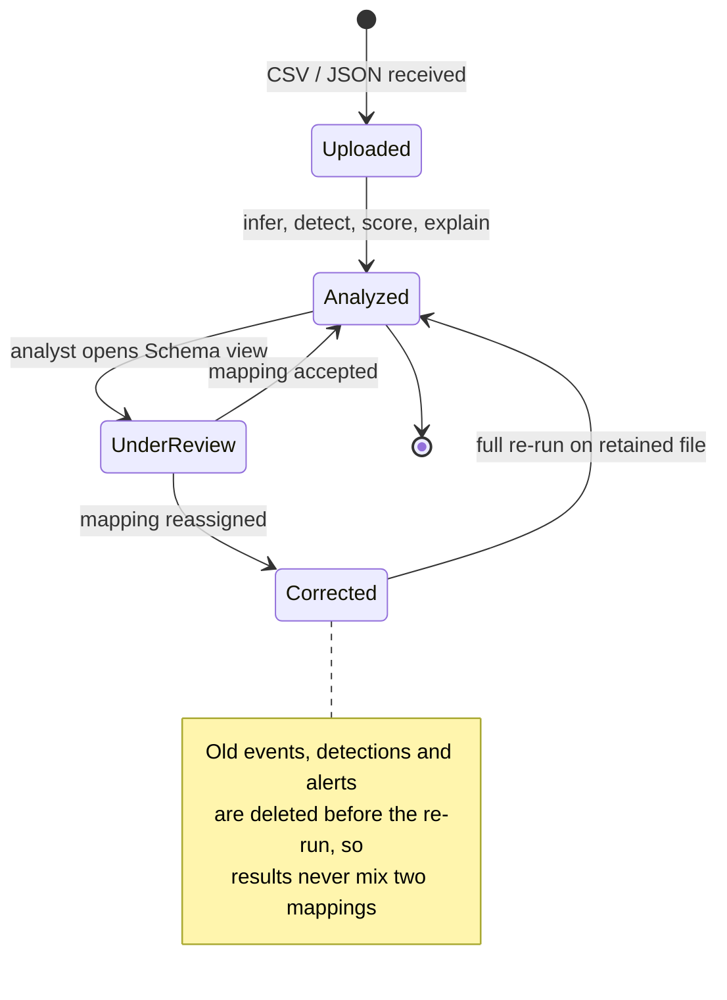

---

## Will it work on my data?

Column **names** genuinely don't matter. Column **structure** does. Four hard
requirements - all four, or the analysis honestly returns nothing.

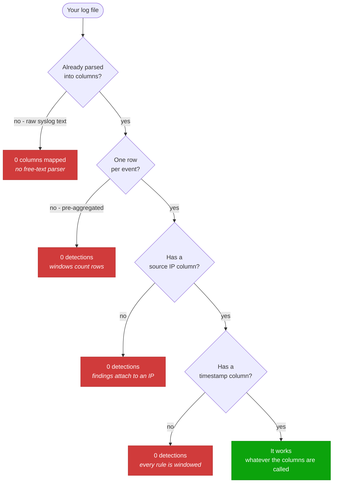

Each of those failure paths is **verified in the test suite**, not assumed.

### Log sources by fit

| ✅ Works well | 🟡 Partially | ❌ Won't work |
|---|---|---|
| SSH / auth logs | IDS / IPS alerts | Raw unstructured syslog |
| Windows Security (4624/4625) | Proxy logs | EDR / process telemetry |
| nginx, Apache, ALB, CloudFront | LB logs without paths | File-integrity monitoring |
| WAF logs | | DNS without client IP |
| Firewall, netflow, Zeek `conn.log` | | Packet captures (pcap) |
| VPN, RADIUS | | Application error logs |
| Okta, Azure AD, CloudTrail sign-ins | | Anything pre-aggregated |

### Field requirements per detector

| Detector | Source IP | Timestamp | Also needs |
|---|---|---|---|
| Brute force | required | required | username · failure signal |
| Credential spraying | required | required | username · failure signal |
| Port scanning | required | required | port |
| Endpoint probing | required | required | request path (status code helps) |
| Behavioural anomaly | required | required | nothing - uses whatever exists |

---

## Quick start

### Local development

```bash
# ── backend ──────────────────────────────────────────
cd backend
python -m venv .venv
.venv/Scripts/python -m pip install -r requirements.txt      # Windows
# source .venv/bin/activate && pip install -r requirements.txt  # macOS / Linux

python -m synthetic.generate_datasets      # writes data/samples/
python -m uvicorn main:app --reload        # :8000

# ── frontend (second terminal) ───────────────────────
cd frontend
npm install
npm run dev                                # :5173
```

Defaults to SQLite, so there is no database to set up. Point `DATABASE_URL` at Postgres
(`postgresql+psycopg://...`) when you want persistence - that is what docker-compose does.

Optional, for the stronger embedding backend:

```bash
pip install -r backend/requirements-ml.txt
```

---

## Using it

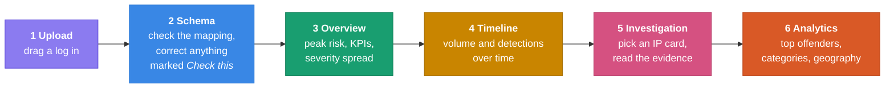

Start with `data/samples/web_logs_b.json` - 11 deliberately renamed columns, and all five
detectors fire on it.

---

## Data model

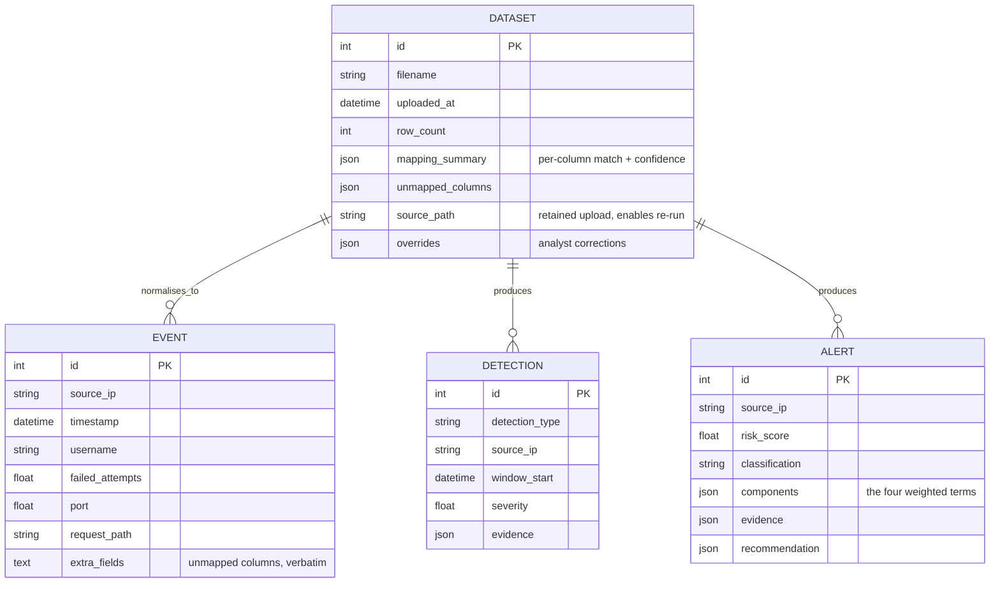

---

## API

| Method | Endpoint | Purpose |
|---|---|---|
| `GET` | `/api/health` | status + which embedding backend is live |
| `GET` | `/api/ontology` | the 13 canonical fields |
| `POST` | `/api/datasets` | upload and analyse a log |
| `GET` | `/api/datasets` | list analysed datasets |
| `GET` | `/api/datasets/{id}/schema` | per-column mapping, dtype, samples, confidence |
| `PUT` | `/api/datasets/{id}/schema` | **correct the mapping and re-run** |
| `GET` | `/api/datasets/{id}/overview` | KPIs and distributions |
| `GET` | `/api/datasets/{id}/timeline` | bucketed volume and detections |
| `GET` | `/api/datasets/{id}/alerts` | scored alerts, highest risk first |
| `GET` | `/api/datasets/{id}/ips/{ip}` | full investigation for one IP |
| `GET` | `/api/datasets/{id}/analytics` | offenders, categories, geography |

Interactive docs at `/docs`.

---

## Testing

```bash
cd backend
.venv/Scripts/python -m pytest tests/ -v      # 48 tests
```

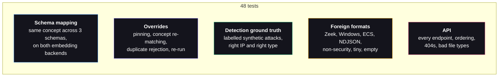

The **foreign-format** suite matters most: the sample data was written alongside the
ingestion layer, so passing on it proves less than it looks. Those tests use shapes the
system was never designed around - and four of them crashed the app before they existed.

The dashboard is also verified end-to-end in headless Chromium: upload, every page, zero
console errors.

---

## Project layout

```
backend/
  ingestion/      ontology · semantic_analyzer · schema_mapper · normalizer · loader
  detection/      brute_force · credential_spray · port_scan · endpoint_probe
                  anomaly_detector · windowing
  intelligence/   risk_engine · threat_explainer
  geoip/          bundled offline IP-to-country table
  synthetic/      dataset generator + labelled attack scenarios
  db/             SQLAlchemy models · session
  api/            routes/ · pipeline · schemas
  tests/          48 tests
frontend/src/     pages/ · components/ · theme.js · api.js
docs/             landing page (GitHub Pages source)
docker/           Dockerfiles · nginx config
data/samples/     generated sample datasets + ground truth
```

**Stack** - Python 3.12 · FastAPI · pandas · scikit-learn · SQLAlchemy 2 · Pydantic v2 ·
PostgreSQL · sentence-transformers · React 18 · Vite · Tailwind CSS · Recharts · Docker
Compose · pytest


---


<div align="center">

**Built to be honest about what it knows.**

</div>
